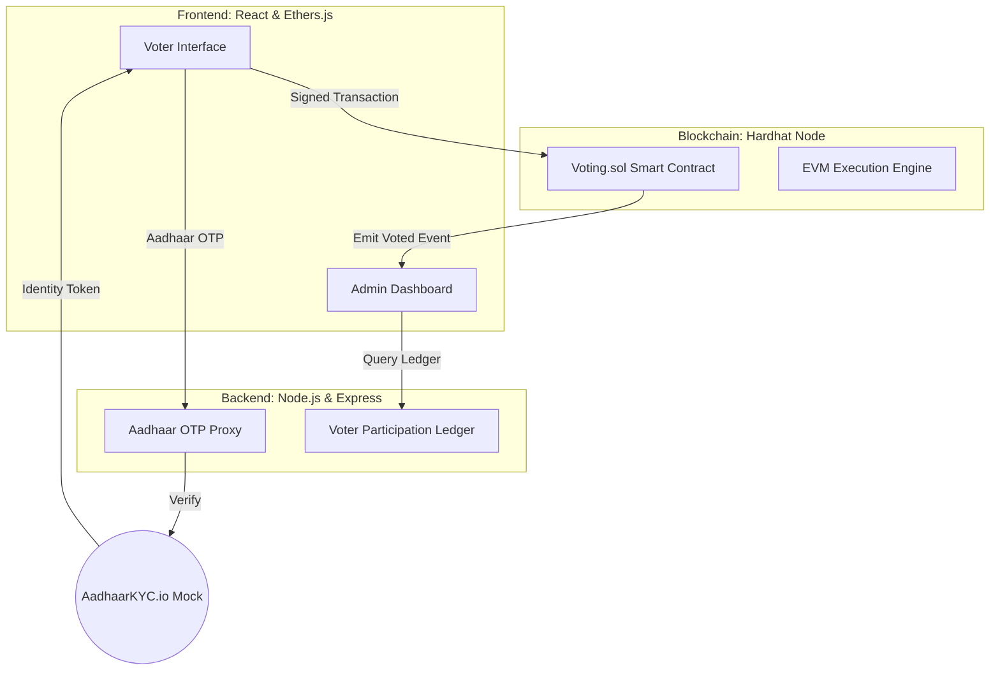

# 🗳️ VoteChain India: The Future of Decentralized Democratic Voting


[](https://vitejs.dev/)
[](https://reactjs.org/)
[](https://www.typescriptlang.org/)
[](https://tailwindcss.com/)
[](https://hardhat.org/)
[](https://opensource.org/licenses/MIT)

**VoteChain India** is a production-grade, end-to-end e-voting platform that leverages **Ethereum-compatible Blockchain technology** and **Aadhaar-based Identity Verification** to create a system that is impossible to rig, easy to audit, and accessible to everyone.

---

## 📖 Table of Contents
1. [Vision & Goal](#-vision--goal)
2. [Core Features](#-core-features)
3. [System Architecture](#-system-architecture)
4. [Technical Deep Dive](#-technical-deep-dive)
    - [Aadhaar KYC Integration](#aadhaar-kyc-integration)
    - [Blockchain Smart Contract](#blockchain-smart-contract)
5. [User Journey](#-user-journey)
6. [Getting Started](#-getting-started)
7. [Project Structure](#-project-structure)
8. [Security & Privacy](#-security--privacy)
9. [Troubleshooting](#-troubleshooting)
10. [Future Roadmap](#-future-roadmap)

---

## 🎯 Vision & Goal
In traditional voting systems, trust is centralized in a single authority. **VoteChain India** decentralizes this trust. Our goal is to provide:
- **Zero Collusion:** No single party can alter the results.
- **Universal Auditability:** Every citizen can verify their vote is counted.
- **Identity Privacy:** Validating *who* you are without storing *who* you voted for.

---

## ✨ Core Features

### 🔐 1. Cryptographic Identity Binding
- **Aadhaar OTP Sync:** Real-time integration with a mock AadhaarKYC.io service.
- **One Person, One Vote:** Strict session control and backend sets prevent double-voting.
- **ZK-Proof Simulation:** Verifies voter eligibility without revealing PII (Personally Identifiable Information) on the blockchain.

### ⛓️ 2. Immutable Ledger
- **Ethereum-Based:** Built on top of the EVM (Ethereum Virtual Machine).
- **Public Audit Trail:** A live-streaming "Block Explorer" for the election ledger.
- **Tamper-Evident:** Any modification to past votes would invalidate the entire chain hash.

### 📊 3. High-Fidelity Admin Dashboard
- **Network Health Management:** Monitor Block Time, Gas Used, and Validator Uptime.
- **Dynamic Analytics:** Real-time participation charts and demographic breakdowns.
- **Transaction Inspector:** Deep-dive into individual voting receipts.

---

## 🏗️ System Architecture

VoteChain India uses a robust 3-tier architecture designed for scale and security.



---

## 🔍 Technical Deep Dive

### Aadhaar KYC Integration
The system uses a sophisticated mock of the **AadhaarKYC.io** API. 
1. **OTP Generation:** `POST /api/otp/send` registers a `client_id` and sends a simulated OTP.
2. **Deterministic Profiles:** Based on the Aadhaar Number, the server generates unique mock names, ages, and addresses to simulate a real database.
3. **Double-Voting Set:** Once a `citizenId` is verified and a vote is cast, their ID is added to a `Set` in the Node.js backend, blocking further attempts.

### Blockchain Smart Contract
Located at `contracts/Voting.sol`, the contract manages the core election logic:
```solidity
function vote(uint256 _candidateId) public {
    require(voters[msg.sender].isRegistered, "Voter is not authorized");
    require(!voters[msg.sender].hasVoted, "Voter has already voted");
    
    voters[msg.sender].hasVoted = true;
    candidates[_candidateId].voteCount++;
    
    emit Voted(msg.sender, _candidateId, receiptHash);
}
```

---

## 🛤️ User Journey

1.  **Landing:** User views live election statistics.
2.  **Verification:** User enters a 12-digit Aadhaar number and undergoes OTP verification.
3.  **Ballot:** User chooses a candidate from the secure interface.
4.  **Confirm:** The browser prompts for a blockchain signature (simulated).
5.  **Receipt:** A unique **Transaction Hash** and **Receipt ID** are generated.
6.  **Audit:** The user can go to the "Audit Trail" to see their vote (anonymously) added to the ledger.

---

## 🚀 Getting Started

### Prerequisites
- **Node.js:** v18.0.0+ 
- **Package Manager:** NPM or Bun
- **OS:** Windows/Linux/macOS (optimized for Windows via `.ps1` script)

### Step 1: Install Dependencies
```bash
npm install
```

### Step 2: Automated Startup
Run our all-in-one startup script to spin up the Blockchain, Backend, and Frontend.
```powershell
./start.ps1
```
*Note: If you are on Linux/macOS, you will need to open three terminals and run `npx hardhat node`, `npm run server`, and `npm run dev` separately.*

### Step 3: Deployment (Smart Contract)
In a separate terminal, deploy the voting contract to your local node:
```bash
npx hardhat run scripts/deploy.ts --network localhost
```

---

## 📁 Project Structure

| Directory | Purpose |
| :--- | :--- |
| `contracts/` | Solidity smart contracts for on-chain voting. |
| `server/` | Express.js server handling OTP logic and off-chain caching. |
| `src/pages/` | React views (Landing, Voting, Admin, Verification). |
| `src/components/` | Reusable UI modules (Navbar, Footer, Charts). |
| `public/` | Static assets like the project banner and icons. |
| `start.ps1` | DevOps script to orchestrate the multi-service launch. |

---

## 🛡️ Security & Privacy

> [!IMPORTANT]
> **Data Anonymity:** While the blockchain is public, the link between your Aadhaar number and your Vote Hash is NEVER stored. The backend only tracks *that* you voted, not *who* you voted for.

- **Encrypted Communication:** All API calls are designed for HTTPS.
- **Smart Contract Isolation:** The contract only permits authorized voters (authorized via the admin/Aadhaar bridge).
- **Mock ZK-Proofs:** The system includes a simulation of Zero-Knowledge proofs to demonstrate how eligibility can be proven without data exposure.

---

## 🔧 Troubleshooting

- **Port 5173 / 3001 busy?** Kill existing node processes or change ports in `vite.config.ts` and `server/index.js`.
- **Hardhat Node Error:** Ensure you have compiled the contracts first using `npx hardhat compile`.
- **OTP Not Received?** Check the **Terminal Output** of the Backend process; the "sent" OTP is logged there for testing.

---

## 🗺️ Future Roadmap
- [ ] **Mobile Integration:** React Native app for voting via smartphones.
- [ ] **Biometric API:** Real integration with UIDAI biometric scanners.
- [ ] **DAO Governance:** Multi-admin approval for starting/stopping elections.
- [ ] **L2 Scaling:** Deploying on Polygon or Optimism for lower gas fees.

---

## 📄 License
This project is licensed under the MIT License - see the [LICENSE](LICENSE) file for details.

---

**✨ Made for the Democracy of Tomorrow. ✨**


